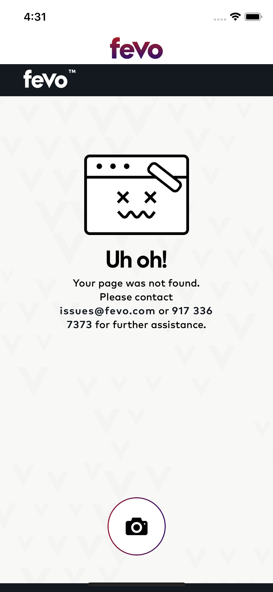

# QRReader
QR Code reader app

# Commit format
For commit format we're using emoji codes that can be found here - https://github.com/dannyfritz/commit-message-emoji.

## Running the App Locally
- Clone the repo from GitHub (the *Master* branch is the latest stable release)
- Install the pods (Swift 3rd party libraries)
    - Install the *cocoapods* ruby gem
        - https://guides.cocoapods.org/using/getting-started.html
        - Run the command `pod --version` in the Terminal to check if cocoapods is installed
    - Run the *pod install* command from the project directory
- Open the *.xcworkspace* file

## Notes

When app detects valid QR code with valid URL - it's going to automatically open WebView with that link, otherwise it will throw a warning.

# Screenshots

## Onboarding

  
   

## Empty states

  
   

## Checkin - native flow

  
   
   
   

## Account 

  
   

## QR Scanning confirmation 

  

## Loading state

  

## Web checkin

  

## Error state

  

